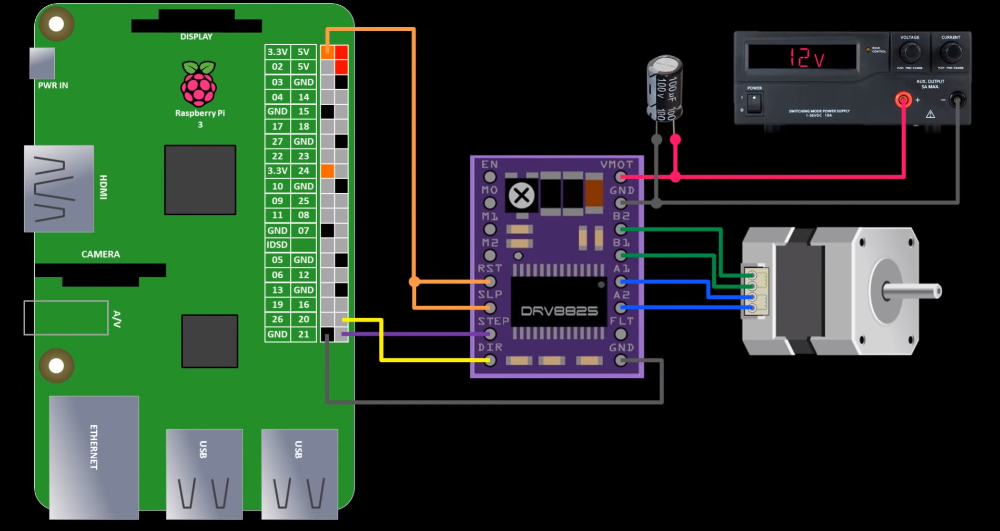

# RFID_Lock_Control

A small system, used to turn a key, based on RFID authorization.

## Hardware used

This is a list of the main parts (not including required wires etc.)

- Raspberry Pi Zero W
- Stepper Motor ( 12V 1.5A )
- 12V Power Supply
- Motor Driver ( UEETEK **DRV8825** )
- RFID Writer / Reader ( AZDelivery RFID kit RC522 (including RFID chip))
- 3D printed parts (see [stls folder](./stsls))

## Wiring

### Stepper Wiring

### RFID Wiring

## Stepper

To connect stepper motor with driver and raspberry, refer to this [youtube video](https://www.youtube.com/watch?v=LUbhPKBL_IU&t=258s).  
Don't miss to adjust the motor driver, so you don't fry your motor. (set current max. 71% of max. motor current, in this case 1.5Ah --> driver current max. 1.065A (0.71 x 1.5). You should be fine with ~0.7A).

## RFID

To setup the RFID module, refer to [this guide](https://pimylifeup.com/raspberry-pi-rfid-rc522/)  
  
**tldr**:

- sudo raspi-config -> interfacing options -> activate spi interface
- reboot
- sudo nano /boot/config.txt --> uncomment (or if not exist, add) the line `dtparam=spi=on`
- sudo apt-get update
- sudo apt-get upgrade
- sudo pip3 install spidev
- sudo pip3 install mfrc522

## Setting things up for linux systems (developed for Raspberry Pi)

* Install python3
* Checkout this repository on raspberry pi
* Install modules listed in `requirements.txt`
* Make `main.py` executable
    * $ `chmod +x main.py`
* Copy `rlc.service` to `/lib/systemd/system`
* Change `ExecStart=` command inside `rlc.service` accordingly to the path where `main.py` is located
* Enable daemon process
    * $ `sudo systemctl daemon-reload`
    * $ `sudo systemctl enable rlc.service`
    * $ `sudo systemctl start rlc.service`
* Enable daily reboot at midnight (to automatically fix (e.g.) networking errors
  * `sudo crontab -e`
  * Enter as new line and save --> `0 0 * * * /sbin/reboot`

## Useful commands for process monitoring

* Check status
    * $ `sudo systemctl status rlc.service`
* Start service
    * $ `sudo systemctl start rlc.service`
* Stop service
    * $ `sudo systemctl stop rlc.service`
* Check service's log
    * $ `sudo journalctl -f -u rlc.service`
