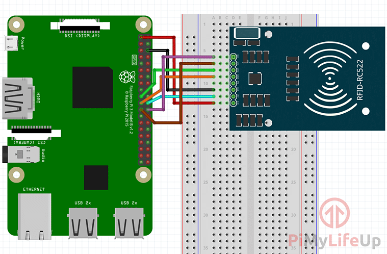
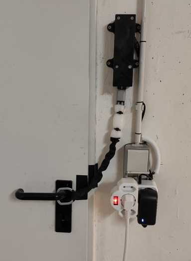

# RFID_Lock_Control

A small system, used to turn a key, based on RFID authorization.

> For more pictures / gifs, check the [Illustration](#Illustration) section.

## Hardware used

This is a list of the main parts (not including required wires etc.)

- Raspberry Pi Zero W
- Stepper Motor ( 12V 1.5A )
- 12V Power Supply
- Motor Driver ( UEETEK **DRV8825** )
- RFID Writer / Reader ( AZDelivery RFID kit RC522 (including RFID chip))
- 3D printed parts (see [stls folder](./stls))

## Wiring

### Stepper Wiring

> Note that I connected the `RST` and `SLP` pins of the motor driver not to the 3.3V pin (as shown on the wiring image), but to a GPIO pin that can be set to LOW, in order to be able to deactivate the stepper motor when not used (remove holding torque), to save energy. When you want to turn the stepper motor, raise this pin to HIGH. (Of course, you can also simply connect `RST` and `SLP` to a 3.3V pin (as shown on the wiring image) if you don't want to save energy while the motor is not turning (or want holding torque)).

### RFID Wiring

## Stepper

To connect the stepper motor to the driver and raspberry, refer to this [youtube video](https://www.youtube.com/watch?v=LUbhPKBL_IU&t=258s).  
Don't miss to adjust the motor driver, so you don't fry your motor. (set current to max. 71% of max. motor current, in this case 1.5Ah --> driver current max. 1.065A (0.71 x 1.5). You should be fine with ~0.7A).

## RFID

To setup the RFID module, refer to [this guide](https://pimylifeup.com/raspberry-pi-rfid-rc522/)  
  
**tldr**:

- sudo raspi-config -> interfacing options -> activate spi interface
- reboot
- sudo nano /boot/config.txt --> uncomment (or if not exist, add) the line `dtparam=spi=on`
- sudo apt-get update
- sudo apt-get upgrade
- sudo pip3 install spidev
- sudo pip3 install mfrc522

## Usage

In the file [.registered_uids](./code/.registered_uids), the uids are listed (split by newlines), that are allowed to open the lock.  
If no uids are registered yet, the program will directly enter the learning mode, to register the first uid. **The first listed uid, also works as master key.**  
There are two things you can do with the master key:
1. Register new uids (RFID chips):
    - Therefore, simply scan the master card, the motor will do some short movements to show that the system is in learning mode. Now scan the RFID chip, you want the system to register. After that, the system will do some movements to show it worked (or different movements if not)and continue with its unlock routine.
2. Unlock the system:
    - Therefore, simply scan the master card, the motor will do some short movements to show that the system is in learning mode. Now simply rescan the master card. The system will notice, that this uid is already registered, will stop the learning mode and do its unlock routine.

All other registered uids in [.registered_uids](./code/.registered_uids) (line 2 and on), are only allowed to unlock the system, not to register new uids.  
Uids that are not registered (not saved to [.registered_uids](./code/.registered_uids)) won't be able to unlock the system and the system will show that by doing five short movements.  

## Setting things up for autostart on linux systems as service (developed for Raspberry Pi)

* Install python3
* Checkout this repository on raspberry pi
* Install modules listed in `requirements.txt`
* Make `main.py` executable
    * $ `chmod +x main.py`
* Copy `rlc.service` to `/lib/systemd/system`
* Change `ExecStart=` command inside `rlc.service` accordingly to the path where `main.py` is located (incl. 'main.py' at the end)
* Change `WorkingDirectory=` command inside `rlc.service` accordingly to the path where `main.py` is located (ending with the 'code' folder)
* Enable daemon process
    * $ `sudo systemctl daemon-reload`
    * $ `sudo systemctl enable rlc.service`
    * $ `sudo systemctl start rlc.service`
* Enable daily reboot at midnight (to automatically fix (e.g.) networking errors
  * `sudo crontab -e`
  * Enter as new line and save --> `0 0 * * * /sbin/reboot`

## Useful commands for process monitoring

* Check status
    * $ `sudo systemctl status rlc.service`
* Start service
    * $ `sudo systemctl start rlc.service`
* Stop service
    * $ `sudo systemctl stop rlc.service`
* Check service's log
    * $ `sudo journalctl -f -u rlc.service`

## Illustration

